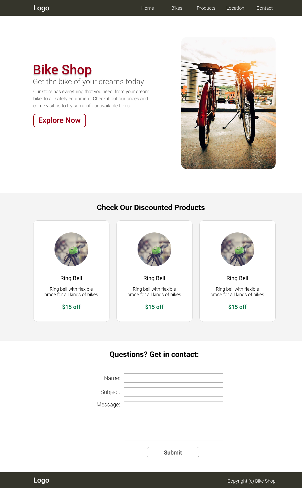
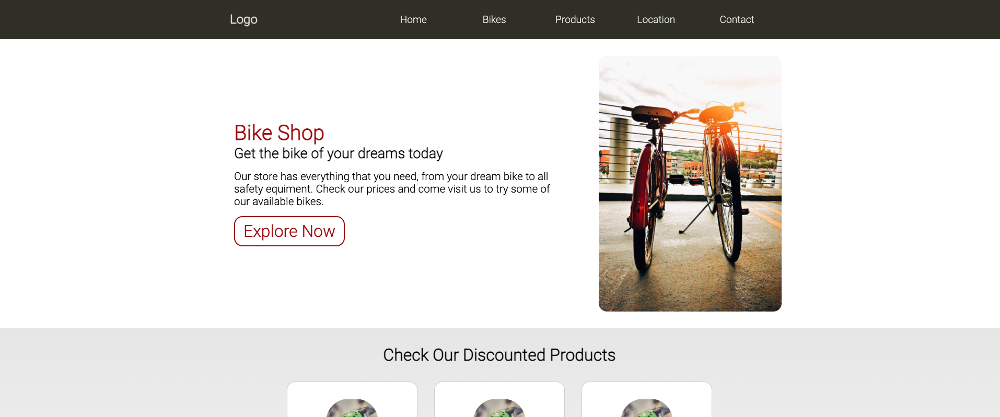
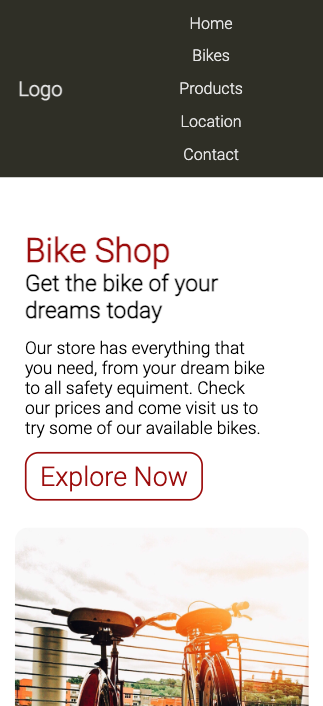

# Simple Layout on pure HTML and CSS

This repository contains a simple layout of a website that was design by myself on Figma and implemented in pure HTML + CSS. The goal of this project was to practice creating website layouts without using any CSS framework, using best practices with CSS Flexbox.

The image below shows the layout designed in Figma:



The design was created to be responsive to big and small screens. Here is a screenshot of the page rendered in a Desktop screen:



And here is a screenshot on iPhone 12 Pro simulation in Chrome Developer tools:



## Why did I do this project?

It's a way to put in practice the new knowledge that I acquired on:

1. How to use Figma to design quick prototype for websites.
2. Learn how to build layouts using Flexbox CSS, without the need of heavy CSS frameworks and keep websites lean.
3. Practice the usage of HTML semantic tags.
4. Explore available tools such as free stock photos from [Pexels](http://www.pexels.com), for example.

## How to see it live in your browser

If you want test the website, you just have to download the files and run locally in your browser. No packages are necessary because it's a simple app in HTML and CSS website. Use git-clone to download this repository to your machine:

```
git clone https://github.com/dscorzoni/bikeshop
```

Then just open index.html in your browser of preference.

Have fun!
